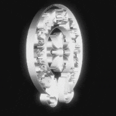

<div align="center">

<a href="https://git.io/typing-svg">
  
</a>

<br/>

</div>

---

<br/>

<div align="center">

<table width="90%">
<tr>

<td style="text-align: left; width: 50%;">

<div style="background-color:#111; padding:20px 25px; border-radius:12px;">

<pre>
◈  Focus     →  Backend / Full-Stack Development
◈  Origin    →  Brazil 🇧🇷
</pre>

</div>

</td>

<td style="text-align: center; width: 50%;">

<div style="overflow:hidden;">



</div>

</td>

</tr>
</table>

</div>

<br/>

## Technologies

<div align="center" >

### Languages

   
 

### Backend & Tools

 
 

</div>

---

<br/>

## About Me

<table width="100%">
<tr>

<td width="50%">

```{
  "name": "Auro",

  "currently_learning": [
    "Node.js",
    "Express",
    "REST APIs",
    "SQL",
    "Java"
  ],

  "interests": [
    "Full-Stack Development",
    "Requirements Engineering"
  ],

  "projects": [
    "Bolso",
    "OrçaFácil"
  ]
}
```

</td>

<td width="40%" align="center">


</td>

</tr>

</table>

<br/>

---

## Socials

<div align="center">

[](https://www.instagram.com/aurick.xy/) [](https://www.linkedin.com/in/aurick-jullian-dutra-56832830a/) [](https://www.tiktok.com/@aurick.xy) [](mailto:aurickdutraa@gmail.com)

</div>
